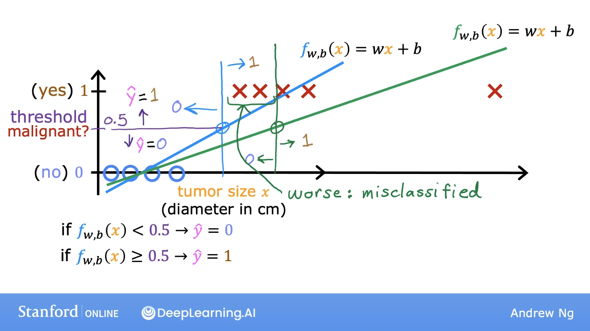
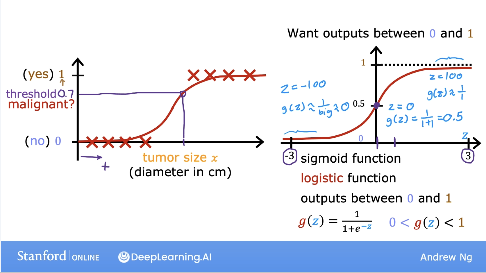
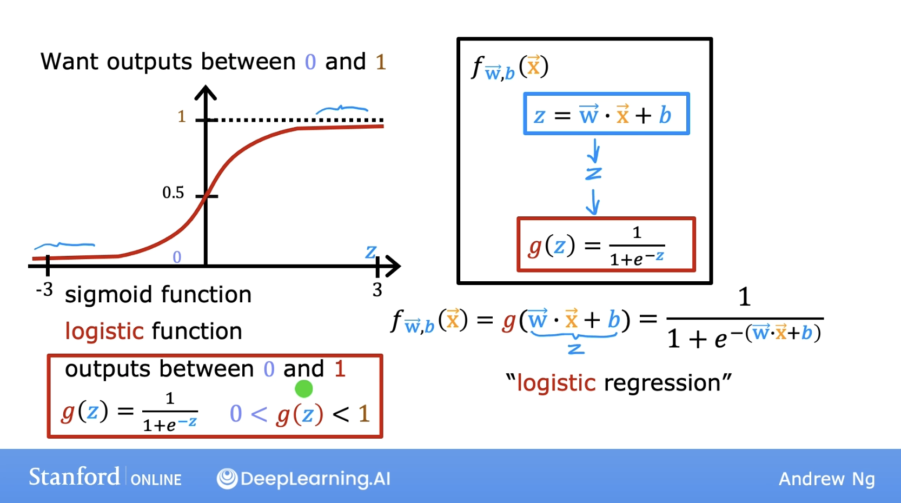
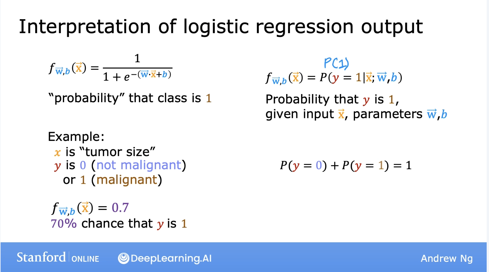
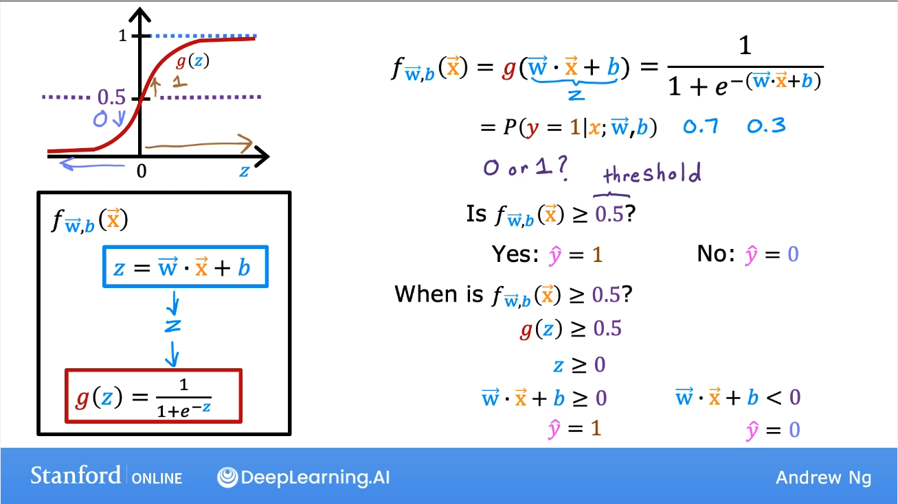
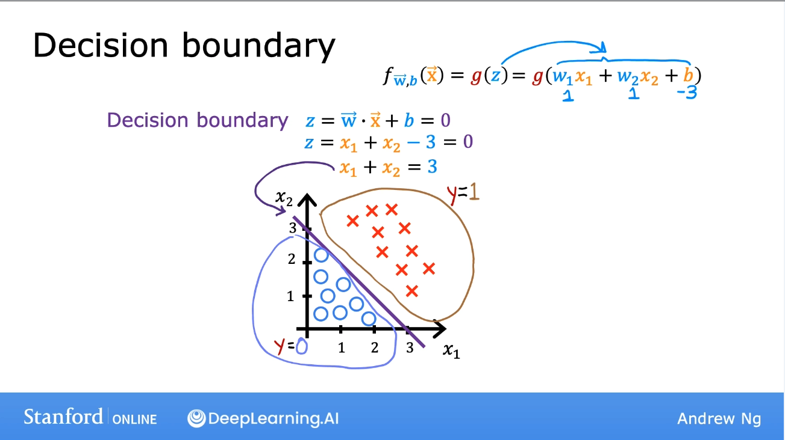
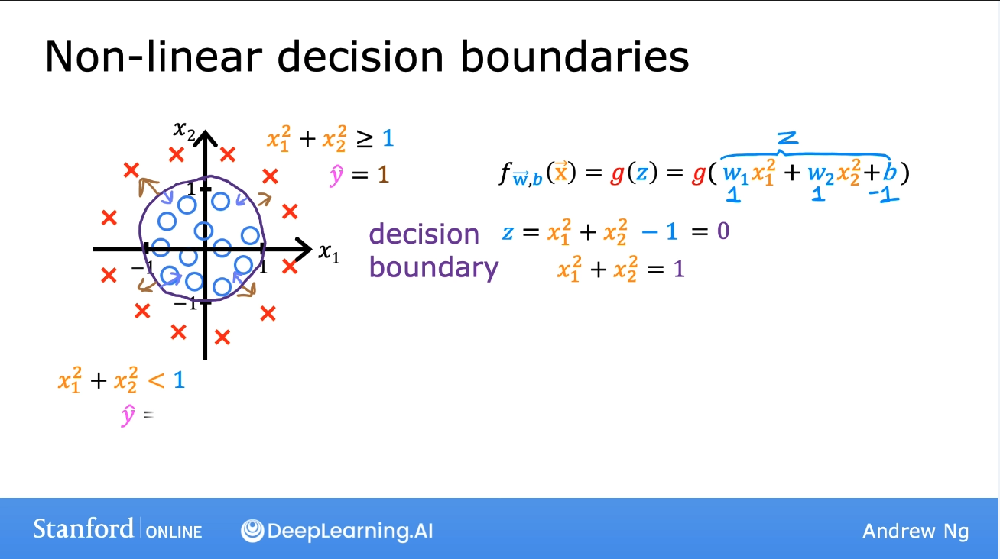
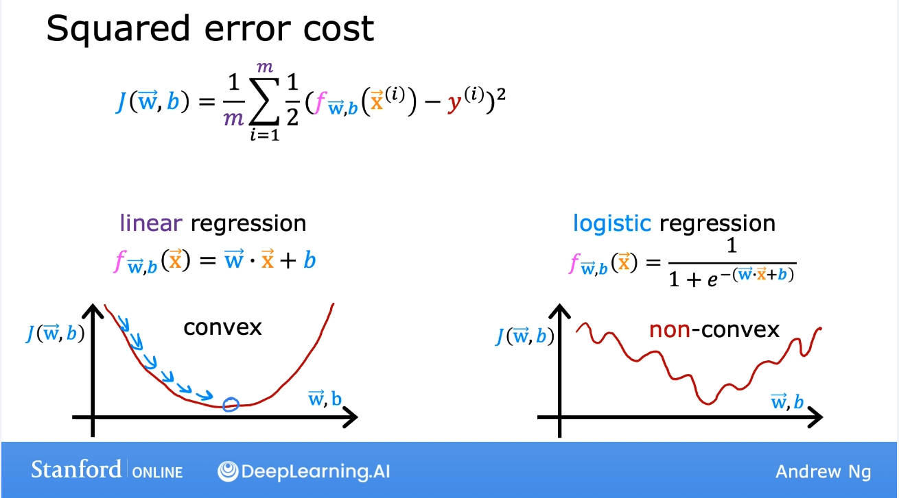

In classification, the output only takes a handful of possible values instead of any number.

Logistic regression algorithm used for classification.

Example: Email is spam or not, Transaction fraudulent, Tumor malignant. In each of these problems, the result can be yes or no.

The answers can also be called 0 or 1, false or true, negative or positive.

In email spam example, negative vs positive means absence of spam in it vs positive means presence of spam in it.

Picture above shows using linear regression for classification problem. The initial blue line which came out of linear regression is okay fit to the classification problem, considering all left of the blue line as benign and all right as malignant. 

However if we consider one more data point, the linear regression model shifts the decision boundary to the right, see green line. This is not a good model because it misclassified many tumor sizes which are malignant as benign.

Logistic regression is used for binary classification. It is the widely used classification algorithm.

Logistic regression will fit a s shaped curve to the dataset. Logistic regression will tell how closer the tumor has a chance of being malignant.

sigmoid function also called logistic function. The horizontal axis takes on both positive and negative values. The output of sigmoid function between 0 and 1.

Using sigmoid function to build logistic regression. Sigmoid function maps all input values to values between 0 and 1.

**Decision boundary**

Below shows a line, where anything to the right of the line is considered a positive or y = 1, anything to the left of the line is negative or y = 0. This is a linear boundary because the decision boundary is a straight line betweent the positive and negative values.

Below shows an example of non-linear boundary.

Non-linear boundary can be even more complex which can produce more complex functions like ellipse or some random shapes.

**Cost function for logistic regression**

We can use squared error cost function to determine the weights and bias for linear regression problem but it is not ideal for classification problem. Look at the above picture. The pic on the left shows cost function applied for linear regression and it gives you a convex function but for logistic regression it gives you a non-convex function, i.e. if you apply the gradient descent there are lots of local minima where we can get struck in.

We can use a different cost function for logistic regression so it will produce a convex function.

